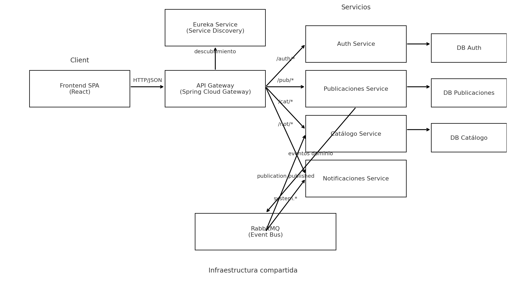
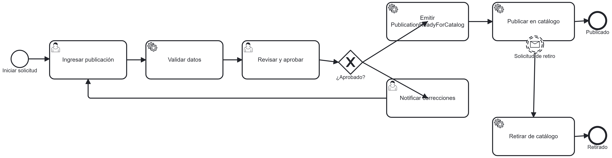

# Arquitectura de Microservicios para la Gestión Integral de Publicaciones

Este repositorio contiene el proyecto final para la materia de Arquitectura de Software, que implementa una plataforma distribuida para la gestión completa del ciclo de vida de publicaciones académicas. El sistema está construido bajo el paradigma de microservicios, demostrando principios de alta disponibilidad, resiliencia y escalabilidad.

---

## 🏛️ Arquitectura del Sistema

La arquitectura está compuesta por seis microservicios backend desacoplados, una base de datos distribuida, un bróker de mensajería y una aplicación frontend de tipo SPA (Single Page Application). La comunicación es orquestada a través de un API Gateway que actúa como punto único de entrada.

## 🏛️ Diagrama de arquitectura



## 🏛️ Modelo BPMN



### Componentes Principales:
* **API Gateway (`gateway-service`):** Punto de entrada único para todas las peticiones del cliente. Se encarga del enrutamiento dinámico, la seguridad perimetral y la gestión de CORS.
* **Service Discovery (`eureka-service`):** Actúa como el registro central donde cada microservicio se inscribe, permitiendo que se descubran dinámicamente en la red.
* **Authentication Service (`auth-service`):** Servidor de autorización centralizado basado en Spring Authorization Server. Gestiona el registro de usuarios, la validación de credenciales y la emisión de JSON Web Tokens (JWT) bajo el estándar OAuth 2.0.
* **Publicaciones Service (`publicaciones-service`):** Contiene la lógica de negocio principal para la creación, edición y gestión del ciclo de vida de las publicaciones. Implementa el patrón Transactional Outbox para garantizar la entrega de eventos.
* **Catálogo Service (`catalogo-service`):** Servicio consumidor que se suscribe a los eventos de `publication.published`. Mantiene una vista desnormalizada de las publicaciones para consultas públicas y eficientes.
* **Notificaciones Service (`notificaciones-service`):** Servicio consumidor que se suscribe a todos los eventos del sistema para simular el envío de alertas y notificaciones a los usuarios.

---

## 💻 Pila Tecnológica (Stack)

| Componente | Tecnología Utilizada |
| :--- | :--- |
| **Backend** | Java 17, Spring Boot 3, Spring Cloud |
| **Frontend** | React (v18), JavaScript (ES6+), Tailwind CSS |
| **Base de Datos** | CockroachDB (Clúster de 3 nodos) |
| **Mensajería Asíncrona** | RabbitMQ |
| **Seguridad** | Spring Security, OAuth 2.0 (Password Grant), JWT |
| **API Gateway** | Spring Cloud Gateway |
| **Service Discovery** | Netflix Eureka |
| **Contenerización** | Docker y Docker Compose |

---

## 🚀 Instrucciones de Despliegue Local

Sigue estos pasos para levantar el entorno completo en tu máquina local.

### Prerrequisitos
* Java 17 o superior
* Maven 3.8+
* Docker y Docker Compose
* Un cliente de Git

### Pasos
1.  **Clonar el repositorio:**
    ```bash
    git clone <URL_DEL_REPOSITORIO>
    cd gestion-publicaciones-microservicios
    ```

2.  **Levantar la infraestructura base:**
    Abre una terminal en la raíz del proyecto y ejecuta el siguiente comando. Esto iniciará los contenedores de CockroachDB y RabbitMQ.
    ```bash
    docker-compose -f infra/docker-compose.yml up -d
    ```
    * Puedes verificar la UI de RabbitMQ en `http://localhost:15672` (user: `user`, pass: `password`).
    * Puedes verificar la UI de CockroachDB en `http://localhost:8090`.

3.  **Ejecutar los microservicios del Backend:**
    Abre una terminal separada para cada microservicio. Es crucial iniciarlos en el siguiente orden para asegurar un correcto registro en Eureka.

    * **1. Eureka Service:**
        ```bash
        cd backend/eureka-service
        ./mvnw spring-boot:run
        ```
      Verifica que el panel de Eureka esté activo en `http://localhost:8761`.

    * **2. Auth Service:**
        ```bash
        cd backend/auth-service
        ./mvnw spring-boot:run
        ```

    * **3. Gateway Service:**
        ```bash
        cd backend/gateway-service
        ./mvnw spring-boot:run
        ```

    * **4. Publicaciones Service:**
        ```bash
        cd backend/publicaciones-service
        ./mvnw spring-boot:run
        ```

    * **5. Catalogo Service:**
        ```bash
        cd backend/catalogo-service
        ./mvnw spring-boot:run
        ```

    * **6. Notificaciones Service:**
        ```bash
        cd backend/notificaciones-service
        ./mvnw spring-boot:run
        ```

    Después de iniciar todos los servicios, refresca el panel de Eureka. Deberías ver los 6 servicios registrados.

4.  **Ejecutar el Frontend:**
    No requiere instalación. Simplemente abre el archivo `frontend/index.html` directamente en tu navegador web (Google Chrome, Firefox, etc.).

---

## 🔑 Flujo de Autenticación

El sistema utiliza OAuth 2.0 con el flujo "Resource Owner Password Credentials Grant".
1.  El usuario introduce sus credenciales en el frontend.
2.  El frontend envía una petición `POST` al endpoint `/oauth2/token` a través del API Gateway.
3.  El `auth-service` valida las credenciales y, si son correctas, genera un **JWT**.
4.  El frontend almacena este token y lo adjunta en la cabecera `Authorization` de todas las peticiones a endpoints protegidos.

### Credenciales por Defecto
Al iniciar el sistema por primera vez, se crea un usuario administrador con las siguientes credenciales:
* **Usuario:** `admin@example.com`
* **Contraseña:** `password`

---

## 📄 Modelo de Proceso de Negocio (BPMN)

El flujo de trabajo editorial, desde la creación del borrador hasta la publicación final, ha sido modelado utilizando la notación BPMN 2.0. El archivo del modelo se encuentra en la siguiente ubicación:
```
/docs/publicacion-workflow.bpmn
```
Este diagrama sirve como una especificación visual y técnica del proceso de negocio principal del sistema.
